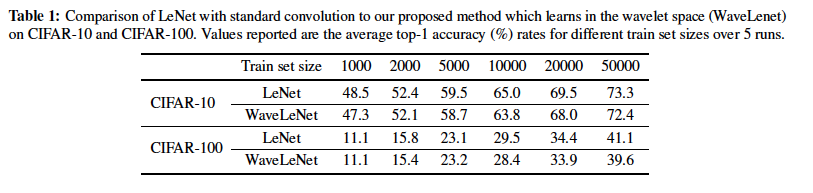
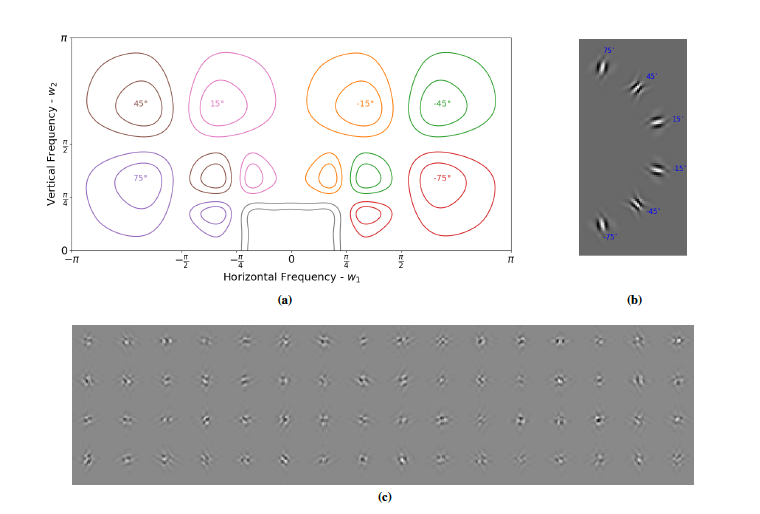

.. image:: https://zenodo.org/badge/157608716.svg
   :target: https://zenodo.org/badge/latestdoi/157608716

GainLayer Experiments
=====================
This repo implements the network described in the paper `Deep Learning in the
Wavelet Domain`__. In particular, it is a way to replicate the results from
Table 1:

The WaveLeNet uses two convolutional layers which learn coefficients in the
wavelet space, rather than in the pixel space. This allows us to selectively
attenuate/enhance frequency regions of the 2-D Fourier plane:

__ https://arxiv.org/abs/1811.06115

Installation
------------
This repo uses my pytorch implementation of the dtcwt: `pytorch_wavelets`__. You
can install this however just by pip installing the requirements.txt.

__ https://github.com/fbcotter/pytorch_wavelets

You can pip install this directory as well, but you do not need to to run
experiments.

Running
-------
The whole suite of tests to create Table 1 can be run by running the
`paper_experiments.py` file. Note that this is written to work on a multi-gpu
system, and loads each gpu with different nets - i.e. it is very intensive and
can take several hours to run. It is recommended to try to run individual nets
first.

.. code:: bash
    
    python main.py -h

Gives full information on all the options available to run, but perhaps a good
simple first test is:

.. code:: bash
    
    python main.py OUTDIR/run1 --net_type lenet_gainlayer  \
        --dataset cifar100  \
        --eval_period 4 \
        --optim adam --lr 0.001 \
        --trainsize 10000 
    python main.py OUTDIR/run2 --net_type lenet \
        --dataset cifar100 \
        --eval_period 4 \
        --optim adam --lr 0.001 \
        --trainsize 10000 

This runs both the LeNet and WaveLeNet architectures on cifar100 with a subset
of the training set.
test
